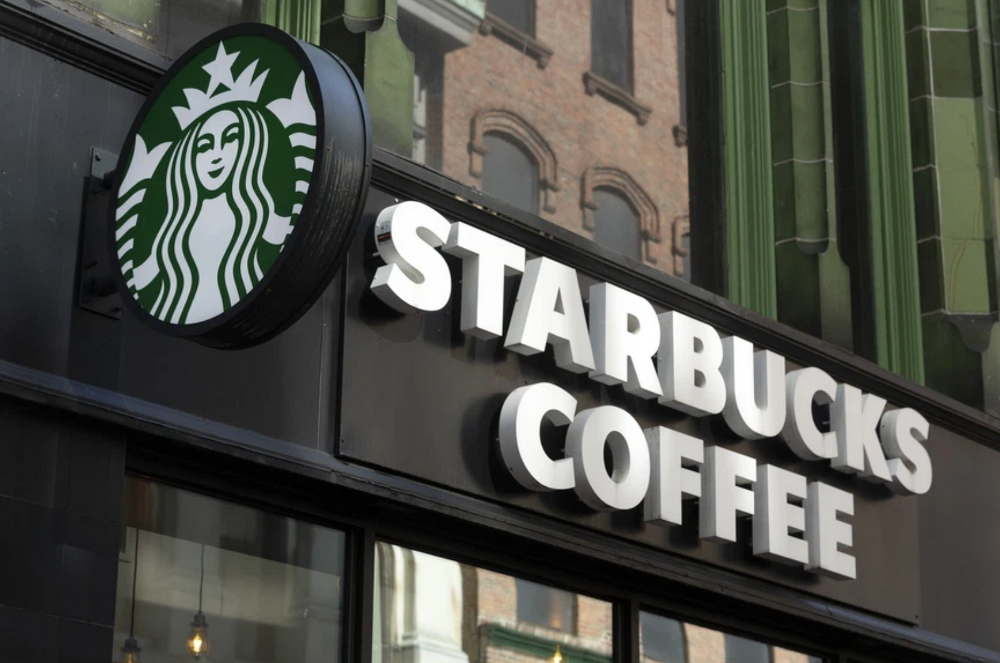

# Udacity Data Scientist Nanodegree - Starbucks Capstone Challenge

## Table of Contents
1. [Description](#description)
2. [Dependencies](#dependencies)
3. [Installing and Executing](#execution)
3. [Additional Material](#additional)

## Description

For my Udacity Data Scientist Capstone Project I decided to analyze the Starbucks offer data, which is provided by Starbucks via Udacity. 
The data consists of 3 data sets containing information on the customers, the published offers and the customer interaction with the offers as well as customer transactions.

I have used the CRISP-DM model as a basis for my work. 

You find he python code for the steps data understanding, data wrangling, exploratory data analysis and modeling in the jupyter notebook in this github repository.

A detailed description of the project, the findings, conclusions and possible next steps is published in the medium blog post https://medium.com/@mac_count/starbucks-offer-analysis-c3f84f4cd88d

Starbucks sent different types of offers (informational, buy one get one free/bogo and discount) by different channels to its registered customers.

The offers have a specific valid time. If in this time an informational offer is received and viewed or a discount/bogo offer is received, viewed and completed by a transaction higher than the minimum spent for this offer (in this order), the offer can be labeled as successful.
There are some cases in which the offer can not be seen as successful. E.g. due to the offer completion is done automatically when the minimum spent for the is reached regardless of whether the order was viewed or not, this offer can be seen as an unsuccessful offer because the customer was not influenced by the offer when making the transaction.

The purpose of the offers is to increase sales and profit. In the first step, it is important that the content of the offers fits the target group and that they are communicated via the right channels so that they are accepted by the target group. Therefore, this project will investigate the question of whether a machine learning model can be created that can predict with sufficient accuracy whether the offer is successful on the basis of a defined offer and a defined target group.

In the EDA I make a deep dive into the data to investigate how the offer success is influenced by customer attributes like age, gender or income or by the offer type and communication channel.
The results are published in the medium blog post.

In the next step I examine different classifier models from Scikit Learn for their suitability to predict the offer success based on the given data.
**The usage of a machine learning model should help the offer responsibles to define offer attributes and target groups more target-oriented.**

With the best fitting classification model, the MLP classifier, I used GridSearch CV for hyperparameter tuning. With the set of the best fitting parameters the model has an accuracy score of 0.694 for train and test data.

The data was provided by Starbucks via Udacity and is contained in three files:

- portfolio.json - containing offer ids and meta data about each offer (duration, type, etc.)
- profile.json - demographic data for each customer
- transcript.json - records for transactions, offers received, offers viewed, and offers completed

### Dependencies

* Python ver. 3.9 minimum
* Data Processing: NumPy, Pandas
* Machine Learning: Sciki-Learn
* Data visualization: Seaborn, Matplotlib

All of these modules can be installed by using the Anaconda package.

### Installing and Executing:

1. Clone this Github repository to your local computer with python and the needed packages installed.

2. Open and run the jupyter notebook

### Additional Material:

In the archive data.zip you find the data files used in this project
